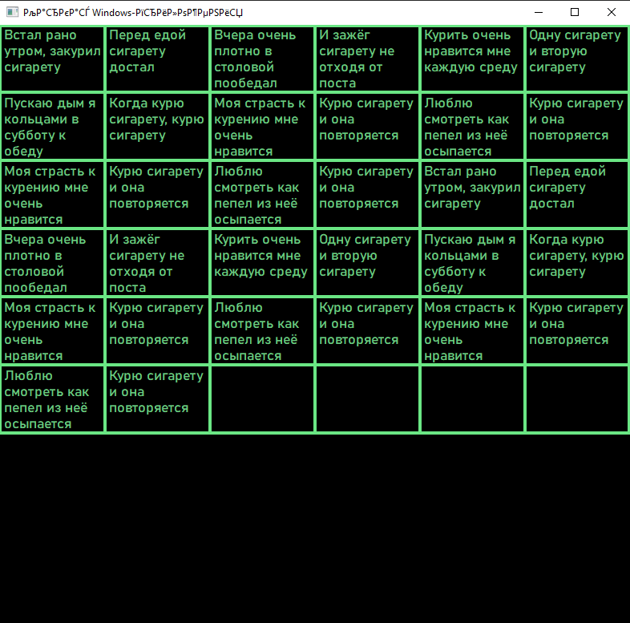
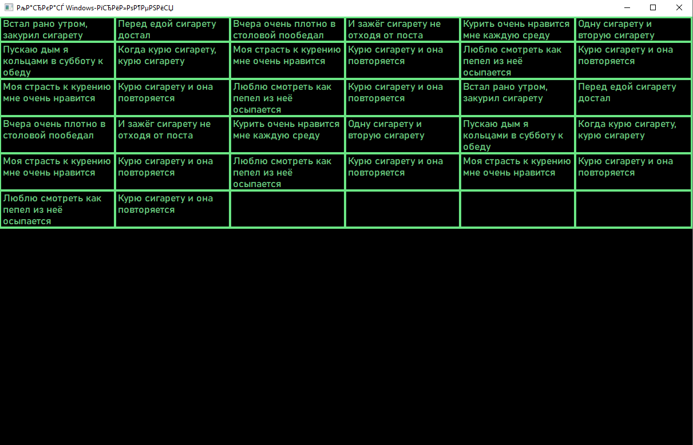

# OSISP2_WinApi2

Изучение вывода текста и шрифтов.

- Разработать программу, которая вписывает в окно текстовую таблицу (N строк на M столбцов) таким образом, что все столбцы таблицы равномерно 
распределяются по ширине окна, а высота строк таблицы подбирается таким образом, чтобы вместить текст каждой ячейки.
- При изменении размеров окна таблица перерасчитывается и перерисовывается.

  
  

  

